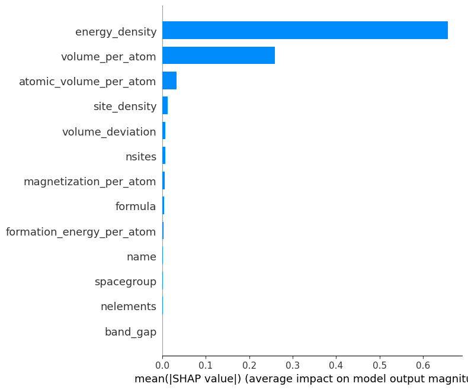

# Materials Discovery

## Project Overview

The project presents an end-to-end machine learning and active learning framework for materials discovery. The system integrates robust data preprocessing, feature engineering, predictive modelling, uncertainity quantification, and Bayesian Optimization along with active learning to accelerate the identification of promising materials with desired properties.

## Table of Contents

• Project Overview

• Dataset Description

• Code Overview

•

•

•

## Dataset Description

This datatset contains structured data designed to train, evaluate, and validate machine learning models for predictive analytics. Key features of the dataset are :-

• ``Name                     ``:- name of matrials

• ``Formula                  ``:- Molecular formula of materials.

• ``Spacegroup               ``:- space group of crystal structure, which defines its symmetry                                      properties based on International Tables for Crystallography.

• ``nelements                ``:- number of distinct elements in compund.

• ``nsites                   ``:- total  number of atomic sites in crystal's unit cell (inclding                                    repeated atoms due to symmetry).

• ``energy_per_atom          ``:- total calculated energy of material normalized per atom 
                                  (eV/atom).This value is derived from density functional theory                                   (DFTcalculations and reflects the stability of structure                                         thermodynamically.

•``formation_energy_per_atom``:- formation energy of material normalized per atom (eV/atom).It
                                  measures energy change when compund forms from its constituent
                                  elements; lower value generally indicates higher stability.

• ``band_gap                ``:- energy difference between valence band maximum & conduction band
                                (eV). Critical property influences electrical conductivity, small
                                band gaps corresponds to semiconductors,while zero band indicates
                                metallic behavior.

• ``volume_per_atom         ``:- volume occupied by each atom in the material(ų/atom).It reflect
                                  atomic packing and can affect density and other structural
                                  properties.

• ``magnetization_per_atom  ``:- net magnetic moment of material normalized per atom (μB/atom,                                     Bohr magnetons per atom). It determines magnetic ordering of 
                                   material (e.g.,ferromagnetic, antiferromagnetic).

• ``atomic_volume_per_atom  ``:- calculated atomic volume per atom (ų/atom) based on atomic                                       structure model. This may differ ** volume_per_atom depending
                                  on structural distortions or defects.

• ``volume_deviation        ``:- percentage deviation between calculated ** volume_per_atom and                                    expected atomic_volume_per_atom .It indicates strain, lattice                                    distortion, or non-ideal packing.

### Dataset    :- https://figshare.com/articles/dataset/CFID_OQMD_460k/13055333?file=24981170

## Workflow Overview

In this section, there is complete machine learning workflow for material property prediction, from preprocessing, through model training, hyperparameter optimization, uncertainity quantification, and active learning with Bayesian optimization.

### Preprocessing

In this section, handles the missing values,performs feature engineering, outlier removal, categorical encoding, feature scaling, and correlation visualization.

• This image shows that dataset is cleaned, normalilized, and transformed for optimal model performance.

### ML modelling

Here,the use of XGBoost with Optuna for hyperparameter tuning to minimize MSE and evaluate with R² score.Includes SHAP explainability to initerpret feature importance.

• Hyperparameters are optimized to improve predictive accuracy, while SHAP identifies most impactful features.

### 

